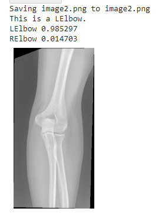

  <h1 align="center">Left or Right Elbow X-ray Classifier</h1>

  

    An image classification AI to discern between left and right elbow x-rays.

  

  

   <a href="https://drive.google.com/drive/folders/1j-aEcx33a9sr8uiT3PsIBlSxbpVgk6ml?usp=sharing">Dataset Used</a>

  
<!-- ABOUT THE PROJECT -->
## About The Project

In participation of a Master's Project, a model to discern between the x-rays is created with 150 unique and hand-chosen elbow anteroposterior x-rays. 

  

  </img>
  

### Built With

* [Python 3.9.6](https://www.python.org/)
* [Google Colab](https://colab.research.google.com/)
* [FastAI](https://www.fast.ai/)
* [MatPlotLib](https://matplotlib.org/)
